<h1 align="center">Hey  I'm MUHAMMAD AIDIL ASYRAF</h1>
<h3 align="center">Future Bilionaire</h3>

  

## 📌 About Me
- I am a high school student from Malaysia who self-taught software engineering from scratch. Without college degrees or bootcamps, I challenge my boundaries by programming, optimizing, and deploying 20+ live, responsive web applications rich in native physics, cybersecurity, and visual design.

## 🧠 My Focus Areas
- Web Development
- Landing page Maker
- Ai Expert
- Fullstack Web Designer
- API expert

## 📊 GitHub Stats & Trophies

  
  

  

  

## 🛠️ Languages & Tools

<h3 align="center">Programming Languages</h3>

  &nbsp;&nbsp;&nbsp;
  &nbsp;&nbsp;&nbsp;
  &nbsp;&nbsp;&nbsp;
  &nbsp;&nbsp;&nbsp;
  &nbsp;&nbsp;&nbsp;
  

<h3 align="center">Frontend</h3>

  &nbsp;&nbsp;&nbsp;
  &nbsp;&nbsp;&nbsp;
  &nbsp;&nbsp;&nbsp;
  &nbsp;&nbsp;&nbsp;
  

<h3 align="center">Backend</h3>

  &nbsp;&nbsp;&nbsp;
  &nbsp;&nbsp;&nbsp;
  

<h3 align="center">Database</h3>

  &nbsp;&nbsp;&nbsp;
  &nbsp;&nbsp;&nbsp;
  

<h3 align="center">DevOps & Cloud</h3>

  &nbsp;&nbsp;&nbsp;
  

<h3 align="center">Tools</h3>

  &nbsp;&nbsp;&nbsp;
  &nbsp;&nbsp;&nbsp;
  

  

## 🔗 Connect with Me

  &nbsp;
  &nbsp;
  &nbsp;
  

## 💬 Quote
> Keep chasing.

  

  

